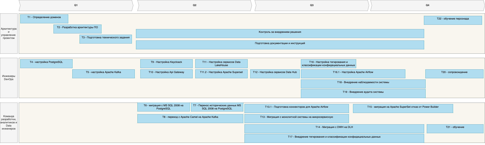

# Технический радар

| Название                         | Квадрант            | Кольцо             |
|----------------------------------|---------------------|--------------------|
| Python                           | Языки и Фреймворки  | Активно используем | 
| React                            | Языки и Фреймворки  | Активно используем | 
| Golang                           | Языки и Фреймворки  | Пробуем            |
| Power Builder                    | Языки и Фреймворки  | Выкидываем         |
| Data LakeHouse                   | Практики и Паттерны | Изучаем            |
| Domain Driven Design             | Практики и Паттерны | Изучаем            |
| Микросервисы                     | Практики и Паттерны | Пробуем            |
| Apache Kafka                     | Платформы           | Пробуем            |
| Apache Superset                  | Платформы           | Пробуем            |
| Kong - API Gateway               | Платформы           | Пробуем            |
| Apache Airflow                   | Платформы           | Изучаем            |
| PostgreSQL                       | Платформы           | Активно используем |
| Dremio                           | Платформы           | Изучаем            |
| MinIO                            | Платформы           | Изучаем            |
| Nessie                           | Платформы           | Изучаем            |
| Apache Camel                     | Платформы           | Выкидываем         |
| Microsoft SQL-сервера 2008 года  | Платформы           | Выкидываем         |
| CI/CD                            | Инструменты         | Активно используем |
| Keycloak                         | Инструменты         | Пробуем            |

# Роадмап

 # Обоснование
 * Т1. Определение доменов - анализ текущей архитектуры и выделение отдельных доменов, данный этап необходим для формирования архитектуры системы
 * Т2. Разработка архитектуры ПО - на основе выделения доменов разрабатывается новая архитектура системы
 * Т3. Подготовка технического задания - без ТЗ затруднена \ невозможна разработка новых сервисов
 * Т4. Настройка PostgreSQL - настройка кластера для миграции БД с MS SQL 2008
 * Т5. Настройка Apache Kafka - настройка сервиса для миграции с Apache Camel
 * Т6. Миграция с MS SQL 2008 на PostgreSQL - необходима, поскольку MS SQL 2008 сильно устарел
 * Т7. Миграция данных с MS SQL 2008 на PostgreSQL - перенос исторических данных в новую БД
 * Т8. Миграция с Apache Camel на Apache Kafka
 * Т9. Настройка Keyckloak - необходима для внедрения SSO авторизации в микросервисной архитектуре
 * Т10. Настройка API Gateway - перед переездом на микросервисы необходимо настройки API Gateway с баланировщиком нагрузки и RateLimitter
 * Т11. Настройка сервисов Data LakeHouse - настройка Apache Iceberg, Nessie Catalogs, MinIO S3.
 * Т11.2. Настройка Apache Superset - для дальнейшей миграции с Power BI
 * Т12. Настройка Data Hub - настройка сервисов Data Hub для возможности интеграции систем AI и Финтеха в систему компании
 * Т13. Миграция с монолитной системы на микросервисную - разработка отдельных сервисов, отказ от монолитной системы
 * Т13.1 - Т15. Миграция с DWH на DLH - по мере разработки микросервисной архитектуры внедряются механизмы для Apache Airflow и миграцией с Power BI на Apache Superset, отказ от Power Builder
 * Т16. Настройка систем для тегирования и классификации персональных данных. Необходима для внедрения системы тегирования и классификации конф. данных на этапе разработки
 * Т17. Внедрение тегирования и классификации данных в разрабатываемые сервисы
 * Т18. Внедрение наблюдаемости системы - настройка ELK, Jaeger и т.д. для централизованного мониторинга, сбора и анализа логов системы
 * Т20. Сопровождение - Возможное внесение изменений в конфигурации системы необходимые для дальнейшей разработки, в т.ч. сопровождение работающей системы
 * Т21 - Т22. ОБучение персонала работе с новой системой, в т.ч. BI 

На всех этапах разработки, архитекторы и PM менеджеры взаимодействуют с командой разработки и инженерами QA для возможного внесения изменений в архитектуру или техническое задание

# Глобально, роадмап можно разделить на несколько этапов:
1. Подготовка архитектурного плана и технического задания
2. Миграция с устаревших технологий Apache Camel, MS SQL 2008
3. Миграция с монолитной системы на микросервисную
4. Миграция на  Data LakeHouse
5. Интеграция с AI - системы и Финтех. системы с DataHub
6. Миграция с Power BI на Apache Superset
7. Внедрение тегирования и классификации конфиденциальных данных, аудита
8. Внедрение наблюдаемости системы
9. Запуск, обучение и сопровождение
